# Employee Atlas

Employee Atlas, çok lokasyonlu büyük şirketlerin - holdingler, havalimanı
işletmecileri, telekom operatörleri, perakende zincirleri, fabrikalar ve
benzeri kuruluşların - şehirler, ülkeler, ofisler, havalimanları, şubeler ve
kampüsler genelindeki iş gücünü keşfetmesine, yönetmesine ve analiz etmesine
yardımcı olan çok-kiracılı (multi-tenant) bir B2B SaaS platformudur.

Her şirket aynı paylaşımlı giriş sayfasından oturum açar. Kimlik doğrulaması
sonrası kullanıcı yalnızca kendi şirketinin çalışma alanını görür: çalışanlar,
lokasyonlar, marka ve rol bazlı yetkiler. Harita öncelikli dashboard,
aranabilir dizin, kısa listeler ve analitik ekranların tümü yalnızca oturum
açan kullanıcının kiracısı üzerinde çalışır.

Örnek (seed) demo kiracıları: **TAV Airports** (havalimanı operasyonları) ve
**Turkcell** (telekomünikasyon ve teknoloji).

**Nihai ürün hedefi:** Sağlam çok-kiracılı temelin üzerine yapay zeka destekli
yetenekler eklemek - semantik (anlamsal) çalışan arama, doğal dil ile filtreleme
ve bir proje/rol için en uygun çalışanları gerekçesiyle öneren bir yapay zeka
ajanı. Nihai teslimde bu AI özellikleriyle birlikte cilalanmış bir demo ve tam
sprint dokümantasyonu hedeflenmektedir.

## Bootcamp - Grup 43

| | |
| --- | --- |
| **Takım numarası** | 43 |
| **Ürün adı** | Employee Atlas |
| **Canlı demo** | [empatlas.site](https://www.empatlas.site/) |

### Takım Üyeleri ve Rolleri

| İsim | Rol | LinkedIn |
| --- | --- | --- |
| Büşra Eşkara | Scrum Master & Developer | [LinkedIn](https://www.linkedin.com/in/busraeskara) |
| Ahmet Berke Çiftçi | Product Owner & Developer | [LinkedIn](https://www.linkedin.com/in/berkecftc) |
| Ömer Burak Avcıoğlu | Developer | [LinkedIn](https://www.linkedin.com/in/omerburakavcioglu) |
| Hümeyra Maden | Developer | [LinkedIn](https://www.linkedin.com/in/h%C3%BCmeyra-maden) |

### Hedef Kitle

Employee Atlas, çok lokasyonlu büyük ölçekli şirketler - holdingler,
havalimanı işletmecileri, telekom operatörleri, perakende zincirleri,
fabrikalar ve benzeri kuruluşlar - için tasarlanmıştır. Bu organizasyonların
İK departmanları, yöneticileri ve teknik koordinatörleri; farklı şehir,
ülke, ofis, havalimanı, şube ve kampüslerdeki iş gücünü keşfetmek, yönetmek
ve analiz etmek için platformu kullanır.

### Demo Hesapları

Aşağıdaki hesapların tamamı canlı ortamda çalışmaktadır. Her hesap yalnızca kendi
kiracısının verisini görür; kiracı yalıtımı doğrudan denenebilir.

**Tüm hesaplar için ortak şifre:** `AtlasDemo2026!`

| E-posta | Kiracı | Rol | Erişim |
| --- | --- | --- | --- |
| tav.admin@demo.com | TAV Airports | Tenant Admin | Yönetim paneli dahil tam yetki |
| tav.hr@demo.com | TAV Airports | HR | Yönetim paneline erişebilir |
| tav.manager@demo.com | TAV Airports | Manager | Arama, filtre, aday listesi |
| turkcell.admin@demo.com | Turkcell | Tenant Admin | Yönetim paneli dahil tam yetki |
| turkcell.hr@demo.com | Turkcell | HR | Yönetim paneline erişebilir |
| turkcell.manager@demo.com | Turkcell | Manager | Arama, filtre, aday listesi |
| grup43@demo.com | Grup 43 | Tenant Admin | Sprint panosu ve dokümantasyon alanı |
| superadmin@demo.com | — (platform) | Super Admin | Tüm kiracıları okur; kiracı bağlamı sabitlenmeden yazamaz |

> Jüri için hazırlanmış tek sayfalık tanıtım dokümanı:
> [employee-atlas-juri-dokumani.html](docs/employee-atlas-juri-dokumani.html)

### Güncel Ürün Durumu

Aşağıdaki tablo, ürünün **bugünkü** canlı durumunu gösterir (sprint bölümleri
kendi dönemlerinin kaydını korur):

| Kiracı | Çalışan | Lokasyon | Departman |
| --- | ---: | ---: | ---: |
| TAV Airports | 110 | 10 | 8 |
| Turkcell | 140 | 14 | 13 |

Canlıdaki başlıca yetenekler: harita panosu, çalışan dizini (kart/liste/tablo +
çok kriterli filtreler), **yapay zeka destekli doğal dil araması** (Google Gemini,
kural tabanlı yedek ayrıştırıcı ile), çalışan profilleri, aday listeleri (CSV
dışa aktarma), analitik, yönetim paneli (CRUD + CSV içe aktarma + alan
görünürlüğü matrisi) ve kiracıya özel tema.

## Sprint 1

**Tarih:** 19 Haziran 2026 – 5 Temmuz 2026 · **Durum:** Tamamlandı · **Canlı demo:** https://empatlas.site

> Sprint hedefi: Temel kurulum, veri modeli, kimlik doğrulama ve çalışan listeleme (MVP çekirdeği).
>
> Detaylı doküman: [Sprint 1 özeti](docs/sprints/sprint-1/sprint1.md)

### Product Backlog

- **Nereden yürüttük:** Product Backlog ve tüm sprint görevleri **Trello** üzerinden takip edildi. Board, iş aşamalarına göre listelere ayrılmıştır: **Backlog → To Do → In Progress → Done** (+ Rejected). Her kart, sorumlusu, story point'i ve başlangıç/bitiş tarihiyle birlikte tutulur; hangi sprinte ait olduğu **renkli etiketlerle** gösterilir: 🟢 yeşil = Sprint 1, 🟡 sarı = Sprint 2, 🔵 mavi = Sprint 3, ⚪ gri = Backlog (sprint dışı). Sprint 1 tamamlandığı için tüm Sprint 1 kartları **Done** listesindedir. (Ayrıca uygulama içinde salt-okunur bir sprint panosu da bulunur: `/sprints`.)
- **Link:** [Trello — Employee Atlas Product Backlog](https://trello.com/b/PF92LZMW/employee-atlas)
- **Ekran görüntüsü:**

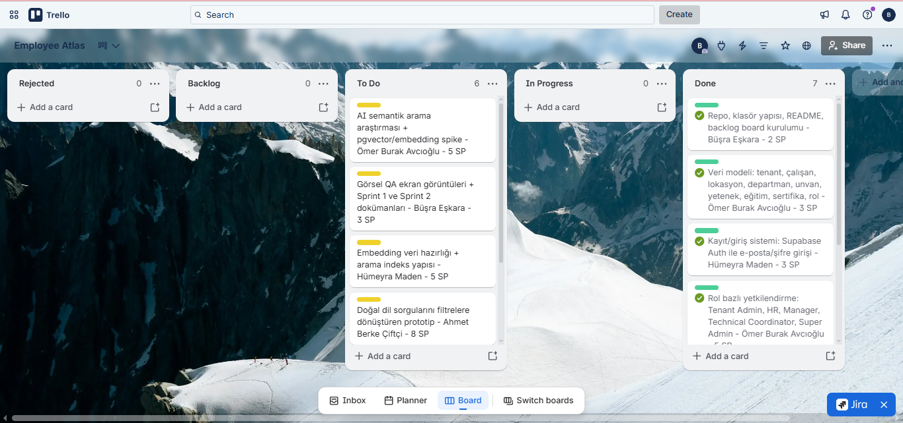
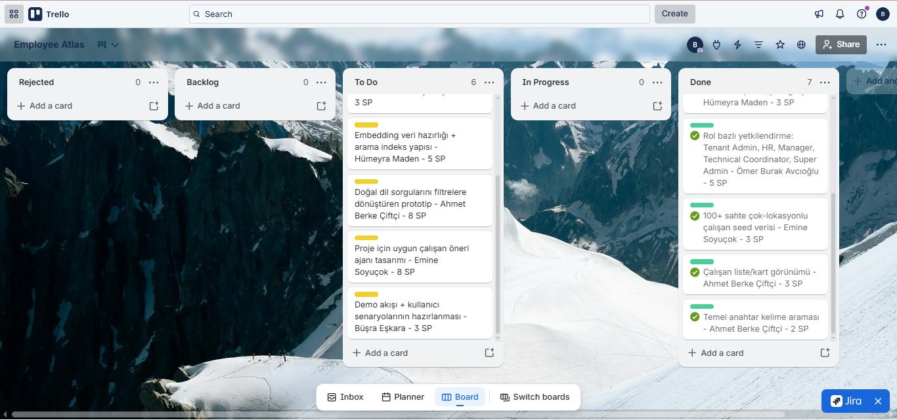

### Sprint Puanlaması

Puanlama, ekip içi göreceli büyüklük tahminiyle (planning poker benzeri) yapıldı. Her göreve karmaşıklığına göre story point (SP) atandı:

- **2 SP** - tek kişinin birkaç saatte bitirebileceği, net kapsamlı görevler
- **3 SP** - orta karmaşıklıkta, birkaç bileşeni kapsayan görevler
- **5 SP** - birden fazla katmanı (veritabanı, uygulama, politika) etkileyen karmaşık görevler

Sprint 1 için **7 görev** açıldı ve toplam kapasite **21 SP** olarak belirlendi. İki haftalık sprinte uygun kapasite hedeflendi.

| Kod | Görev | SP | Durum |
| --- | --- | ---: | --- |
| A1 | Repo, klasör yapısı, README, backlog board kurulumu | 2 | ✅ |
| A2 | Veri modeli (tenant, çalışan, lokasyon, departman, unvan, yetenek, eğitim, sertifika, rol) | 3 | ✅ |
| A3 | Kayıt/giriş sistemi (Supabase Auth, e-posta/şifre) | 3 | ✅ |
| A4 | Rol bazlı yetkilendirme (Tenant Admin, HR, Manager, Technical Coordinator, Super Admin) | 5 | ✅ |
| B1 | 100+ sahte çok-lokasyonlu çalışan seed verisi | 3 | ✅ |
| C1 | Çalışan liste/kart görünümü | 3 | ✅ |
| C3 | Temel anahtar kelime araması | 2 | ✅ |

- **Puanlama mantığı ve toplam:** 7 görev · 21 SP (2/3/5 SP göreceli büyüklük)
- **Tamamlanan:** 21 / 21 SP → **%100 tamamlanma** · Velocity: 21 SP (baseline)

### Daily Scrum

- **Nereden görüştük:** Günlük senkronizasyon **WhatsApp** grubu üzerinden (hızlı durum paylaşımı ve blocker bildirimi) ve **Slack** üzerinden huddle yaparak (geliştirme/teknik koordinasyon) yürütüldü.

- **Ekran görüntüsü:** 
 [Google Drive Linki](https://drive.google.com/drive/folders/1MO36G4rBL_l6UVB_-wARWaUjH9aX1mj8?usp=sharing)

  Sprint boyunca derlenen özet Daily Scrum tablosu: [daily-scrum.md](docs/sprints/sprint-1/daily-scrum.md).

### Ürün geliştirme durumu

Sprint 1 sonunda MVP çekirdeği canlıya alındı. Aşağıdaki ekran görüntüleri ürünün güncel durumunu gösterir:

**Giriş ekranı** - Paylaşılan, kiracıdan bağımsız login sayfası. Tüm kullanıcılar aynı noktadan giriş yapar; doğrulama sonrası yalnızca kendi kiracısının çalışma alanına yönlenir.

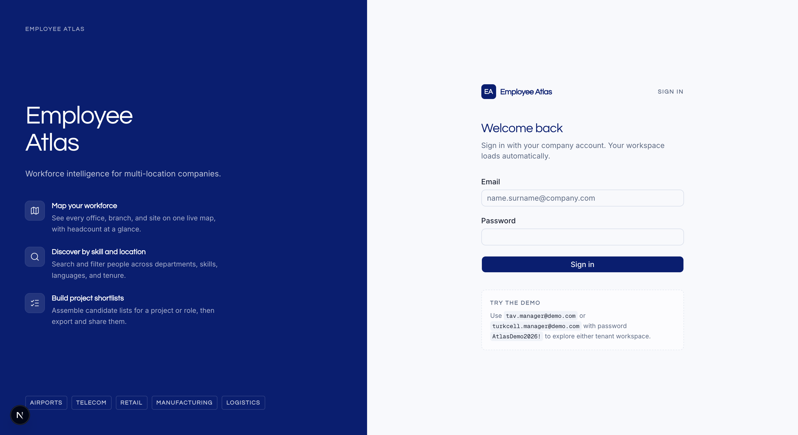

**Harita dashboard (TAV Airports)** - Lokasyon pinleri, çalışan sayıları ve pin tıklamasıyla açılan çalışan kartları. 50 çalışan, 10 lokasyon.

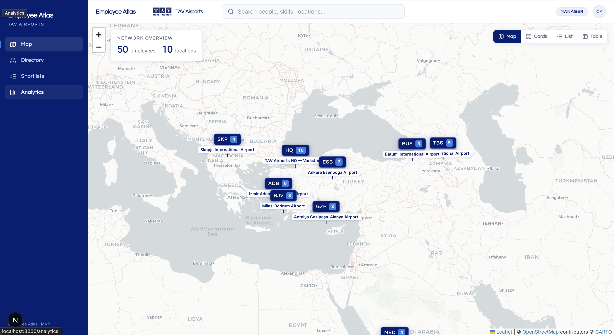

**Çalışan dizini (TAV Airports)** - Tam metin arama, filtreler (lokasyon, departman, yetenek vb.) ve kart/liste/tablo görünümü. Filtreler kiracıya özeldir.

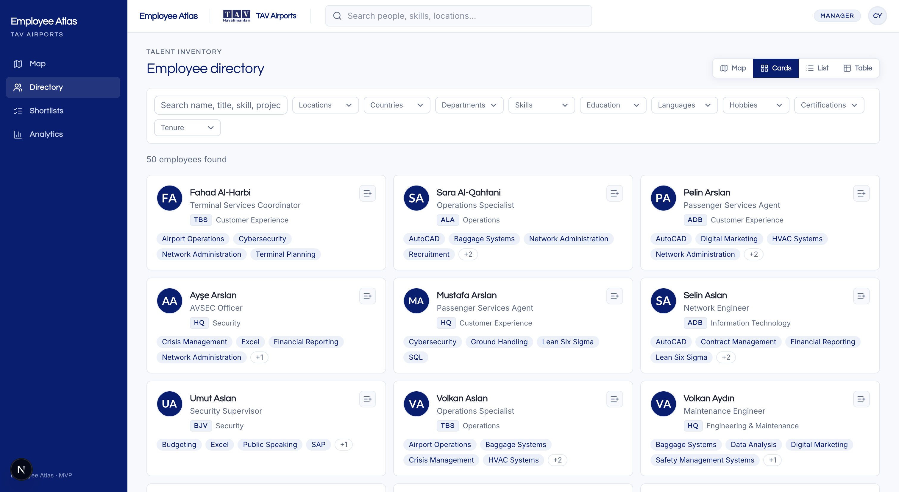

**Analytics (TAV Airports)** - İş gücü KPI'ları ve dağılım grafikleri (lokasyon, departman, yetenek, sertifika); kiracı temasına uyumlu palet.

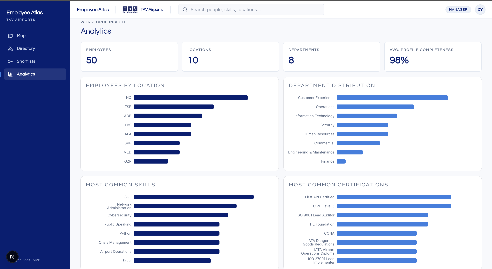

**Grup 43 Sprint Board** - Uygulama içi sprint panosu; Sprint 1 görevleri, story point'ler ve %100 ilerleme (21/21 SP). Kiracı izolasyonu çalışır.

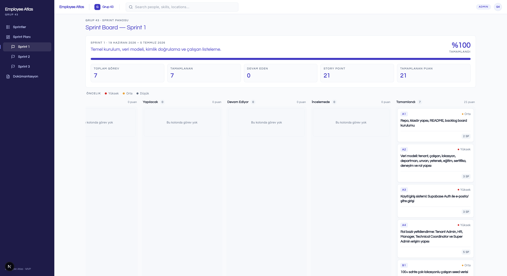

Ayrıntılı ürün durumu: [product-status.md](docs/sprints/sprint-1/product-status.md).

### Sprint Review

Sprint 1'de MVP çekirdeği tamamlandı ve Vercel'e canlı deploy edildi. Sprint Review'da canlı ortamda şu akış gösterildi: giriş → harita dashboard → dizin (arama/filtre) → analytics → kiracı izolasyonu (TAV↔Turkcell geçişi) → Grup 43 sprint panosu.

Şimdiye kadar yapılanlar ve verilen kararlar:

- **Çok-kiracılı mimari** hayata geçirildi: TAV Airports ve Turkcell kiracıları izole çalışıyor (RLS + composite FK + uygulama katmanı, savunma derinliği).
- **Kimlik doğrulama ve 5 rollü erişim** (Tenant Admin, HR, Manager, Technical Coordinator, Super Admin) uygulandı.
- **130+ gerçekçi seed çalışan** (TAV: 50, Turkcell: 80) çok lokasyonlu veriyle demo akışını güçlendirdi.
- **Harita, dizin, profil, shortlist, analytics ve admin paneli** erişilebilir; kiracı temaları uygulandı.
- **AI özellikleri bilinçli olarak Sprint 2/3'e ertelendi** — MVP önce sağlam temele odaklandı.

Tüm planlanan 7 hikaye (21/21 SP) tamamlandı; tamamlanmayan görev yok. Ayrıntı: [sprint-review.md](docs/sprints/sprint-1/sprint-review.md).

### Sprint Retrospective

**İyi gidenler:** Çok-kiracılı mimarinin sprint başında kurulması sonraki UI geliştirmelerini hızlandırdı; canlı deploy başarılı; tüm sprint hedefleri (%100) karşılandı; teknoloji seçimi (Next.js + Supabase) doğrulandı.

**Geliştirilecekler / gelecek sprintte farklı yapılacaklar:**

- **Süreç dokümantasyonunu sprint içinde güncel tutmak** — Daily Scrum, review, retro ve ürün durumu dokümanları sprint sonunda toplu yazıldı; Sprint 2'de paralel tutulacak.
- **Günlük Daily Scrum notlarını düzenli arşivlemek** (SM disiplini).
- **Git katkısını ekibe dağıtmak** — commit/PR katkısı tek yazarda yoğunlaştı; dağıtık katkı hedeflenecek.
- **Eksik ekran görüntülerini tamamlamak** (Turkcell, çalışan profili, shortlist, admin paneli) — Sprint 2 D5 görevi.

**Sonraki sprint planı özeti:** AI semantik arama spike'ı (D1) ile başlanacak; Sprint 2 kapasitesi 32 SP olarak planlandı (Sprint 1 velocity'si 21 SP baseline alınarak). Ayrıntı: [sprint-retrospective.md](docs/sprints/sprint-1/sprint-retrospective.md).

## Sprint 2

**Tarih:** 6 Temmuz 2026 - 19 Temmuz 2026 · **Durum:** Tamamlandı· **Canlı demo:** [empatlas.site](https://www.empatlas.site/) 

> Sprint hedefi: Yapay zeka destekli arama, doğal dil filtreleme ve demo kalitesini artırmak.

### Product Backlog

- **Nereden yürüttük:** Sprint 1 ile aynı **Trello** board'undan. Sprint 2 görevleri (🟡 sarı etiket) iş ilerledikçe **To Do → In Progress → Done** listeleri arasında taşınır; her kartta sorumlu, story point ve başlangıç/bitiş tarihi bulunur. Böylece Sprint 2'nin biten ve devam eden işleri tek bakışta görülür. (Renk lejantı: 🟢 Sprint 1, 🟡 Sprint 2, 🔵 Sprint 3, ⚪ Backlog.)
- **Link:** [Trello - Employee Atlas Product Backlog](https://trello.com/b/PF92LZMW/employee-atlas)
- **Ekran görüntüsü:** (Yalnızca Sprint 2 kartlarını görmek için board'da **Filter → Sprint 2 (sarı)** uygulanabilir.)

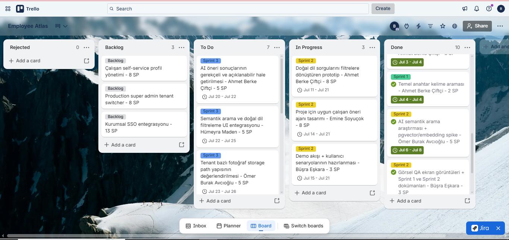
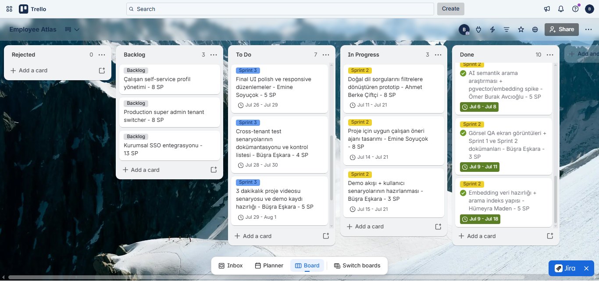
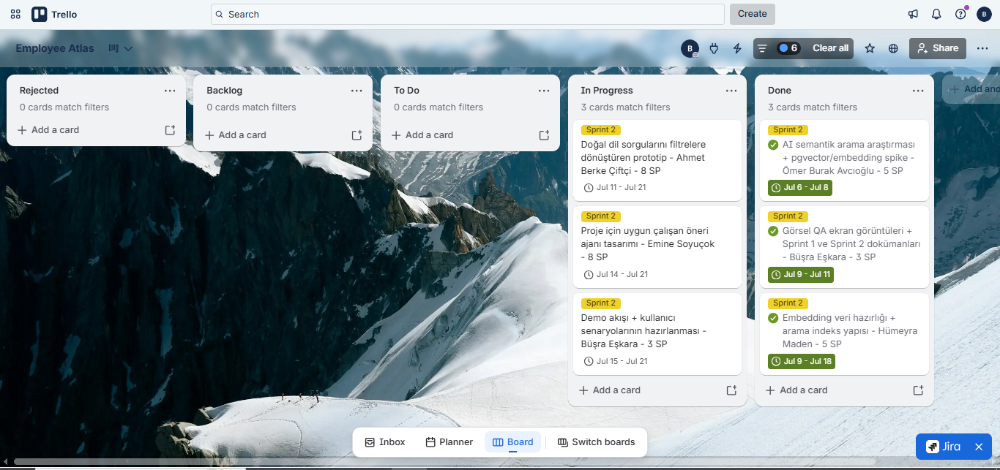

### Sprint puanlaması

Sprint 1'deki puanlama mantığı sürdürüldü (planning poker benzeri göreceli büyüklük). Sprint 2 için **6 görev** açıldı ve toplam kapasite **32 SP** olarak belirlendi. Sprint 1 velocity'si (21 SP) baseline alınarak, AI odaklı ve daha büyük görevler nedeniyle kapasite bir miktar yüksek tutuldu.

- **8 SP** - birden fazla katmanı kapsayan, yüksek belirsizlik içeren AI görevleri (D3, D4)
- **5 SP** - orta-yüksek karmaşıklıkta araştırma/altyapı görevleri (D1, D2)
- **3 SP** - dokümantasyon ve demo hazırlığı görevleri (D5, D6)

| Kod | Görev | SP | Sorumlu | Durum |
| --- | --- | ---: | --- | --- |
| D1 | AI semantik arama teknik araştırması ve pgvector/embedding spike | 5 | ✅ Tamamlandı |
| D2 | Çalışan profilleri için embedding veri hazırlığı ve arama indeks yapısı | 5 | ✅ Tamamlandı |
| D3 | Doğal dil sorgularını filtrelere dönüştüren prototip | 8 | 🔄 Devam ediyor |
| D4 | Proje için uygun çalışan öneri ajanı tasarımı | 8 | 🔄 Devam ediyor |
| D5 | Görsel QA ekran görüntüleri ve Sprint 1 dokümanlarının tamamlanması | 3 | ✅ Tamamlandı |
| D6 | Demo akışı ve kullanıcı senaryolarının hazırlanması | 3 | 🔄 Devam ediyor |

- **Puanlama mantığı ve toplam:** 6 görev · 32 SP (3/5/8 SP göreceli büyüklük)
- **Ne kadarı tamamlandı:** D1 (araştırma/spike: pgvector + embedding yaklaşımı doğrulandı), D2 (embedding veri hazırlığı ve arama indeksi) ve D5 (Sprint 1 dokümantasyonu) tamamlandı → **13 / 32 SP (~%41)**. Kalan 19 SP (D3, D4, D6) doğal dil prototipi, öneri ajanı ve demo hazırlığı olarak devam ediyor.
- **Ek tamamlanan mühendislik kanıtı:** Sprint 2 kapsamında pgTAP tabanlı **RLS izolasyon test suite'i** (5 dosya, 42 assertion) ve her push/PR'da koşan **GitHub Actions CI** tamamlandı ve yeşil. Ayrıntı ve CI koşu linki: [db-tests.md](docs/sprints/sprint-2/db-tests.md).

### Daily Scrum

- **Nereden görüştük:** Sprint 1 ile aynı şekilde günlük senkronizasyon **WhatsApp** grubu (hızlı durum/blocker) ve **Slack** (teknik koordinasyon) üzerinden yürütülüyor. Sprint 2'de günlük notların düzenli tutulması (Sprint 1 retrospektif aksiyonu) uygulanıyor.
- **Ekran görüntüsü:** 

[Google Drive Linki](https://drive.google.com/drive/folders/18Ni6HB8ZvBHDHojrOHswwsU1dLkovu0f?usp=sharing)

### Ürün geliştirme durumu

Sprint 2'de ürün, Sprint 1 MVP çekirdeğinin üzerine **kalite/güvenlik altyapısı** ve **AI arama yeteneği** yönünde ilerliyor. Aşağıda ürünün Sprint 2 itibarıyla çalışan güncel ekranları ile somut mühendislik çıktısı yer alır.

**Çalışan dizini (arama + filtreler)** - Semantik arama çalışmalarının üzerine kurulacağı mevcut tam metin arama ve çok-kriterli filtreleme ekranı.

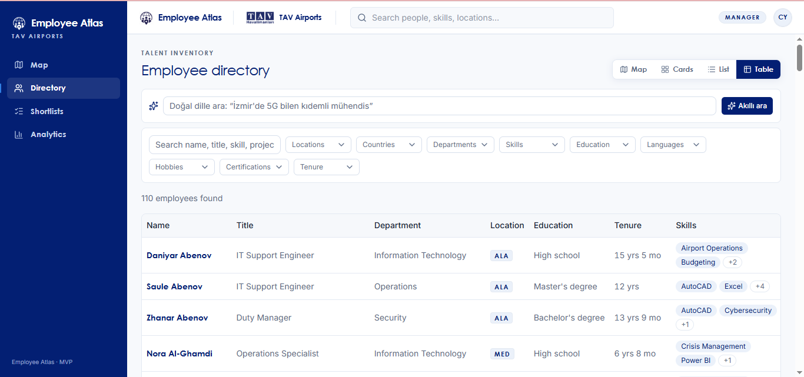
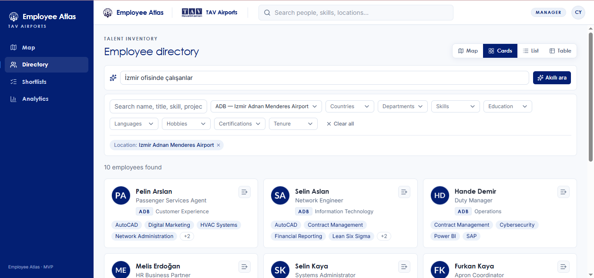

**Tenant izolasyon test suite'i + CI (yeşil koşu)** — Her push ve PR'da CI, veritabanını migration + seed ile sıfırdan kurup 42 izolasyon assertion'ını koşturuyor (`Files=5, Tests=42 — Result: PASS`). Bu, ürünün güvenlik/kalite durumunu kanıtlayan somut bir çıktıdır. Ayrıntı ve CI koşu linki: [db-tests.md](docs/sprints/sprint-2/db-tests.md).

### Sprint Review

Sprint 2, canlı ürünün üzerine kalite ve AI yeteneği eklenmesine odaklandı. Şimdiye kadar yapılanlar ve verilen kararlar:

- **Kalite/güvenlik altyapısı sağlamlaştırıldı:** pgTAP RLS izolasyon test suite'i (5 dosya, 42 assertion) ve her push/PR'da koşan GitHub Actions CI devreye alındı; `main` için "Database tests" check'i merge engeli olarak hedeflendi. Kiracı izolasyonu artık her push'ta otomatik kanıtlanıyor.
- **AI arama yaklaşımına karar verildi ve altyapısı hazırlandı:** Teknik araştırma/spike (D1) sonucunda semantik arama için **pgvector + embedding** yaklaşımı seçildi; embedding veri hazırlığı ve arama indeks yapısı (D2) tamamlandı. Bunun üzerine doğal dil → filtre prototipi (D3) geliştiriliyor.
- **Dokümantasyon borcu kapatıldı:** Sprint 1 süreç dokümanları (daily, review, retro, ürün durumu) ve README sprint bölümleri tamamlandı (D5) - Sprint 1 retrospektif aksiyonu karşılandı.
- **Demo hazırlığı başladı:** Demo akışı ve kullanıcı senaryoları (D6) üzerinde çalışılıyor.

Sprint sonu (19 Temmuz) itibarıyla tamamlanamayan AI görevleri, Sprint 3'e (E1–E2 semantik arama entegrasyonu ve açıklanabilir öneriler) devredilecek şekilde değerlendirilecek. Ayrıntı: [db-tests.md](docs/sprints/sprint-2/db-tests.md).

### Sprint Retrospective

**İyi gidenler:** Sprint 1 retrospektif aksiyonları uygulandı - süreç dokümantasyonu güncel tutuldu ve test/CI altyapısı kuruldu. Kiracı izolasyonunun otomatik test edilmesi güven verdi.

**Geliştirilecekler / gelecek sprintte farklı yapılacaklar:**

- **AI görevlerini daha küçük parçalara bölmek** - 8 SP'lik büyük AI görevleri (D3, D4) tek sprintte bitirilmesi zor oldu; Sprint 3'te AI işleri daha küçük, doğrulanabilir adımlara ayrılacak.
- **AI özelliklerine erken spike ile başlamak** işe yaradı; bu disiplin sürdürülecek.
- **Ekran görüntüsü/QA kanıtlarını iş bittikçe anında eklemek** (sprint sonuna bırakmamak).
- **Git katkısını ekibe dağıtmaya devam etmek** (Sprint 1'den taşınan aksiyon).

**Sonraki sprint planı özeti (Sprint 3):** Final demo, ürün bütünlüğü ve AI özelliklerinin iyileştirilmesine odaklanılacak — semantik arama & doğal dil filtreleme UI entegrasyonu (E1–E2), tenant fotoğraf storage değerlendirmesi (E3), final UI polish (E4), cross-tenant test dokümantasyonu (E5), 3 dakikalık proje videosu (E6) ve final README/teslim hazırlığı (E7). Sprint 3 kapasitesi 33 SP olarak planlandı.

## Sprint 3

**Tarih:** 20 Temmuz 2026 – 2 Ağustos 2026 · **Durum:** Tamamlandı · **Canlı demo:** [empatlas.site](https://www.empatlas.site/) 

> Sprint hedefi: Final demo, ürün bütünlüğü, yapay zeka aramasının UI entegrasyonu ve bootcamp teslim hazırlığı.

### Product Backlog

- **Nereden yürüttük:** Sprint 1 ve 2 ile aynı **Trello** board'undan. Sprint 3 görevleri (🔵 mavi etiket) iş ilerledikçe **To Do → In Progress → Done** listeleri arasında taşındı; her kartta sorumlu, story point ve başlangıç/bitiş tarihi tutuldu. Final sprint olduğu için Sprint 3 kartlarının tamamı **Done** listesine taşındı. (Renk lejantı: 🟢 Sprint 1, 🟡 Sprint 2, 🔵 Sprint 3, ⚪ Backlog.)
- **Link:** [Trello - Employee Atlas Product Backlog](https://trello.com/b/PF92LZMW/employee-atlas)
- **Ekran görüntüsü:** (Yalnızca Sprint 3 kartlarını görmek için board'da **Filter → Sprint 3 (mavi)** uygulanabilir.)

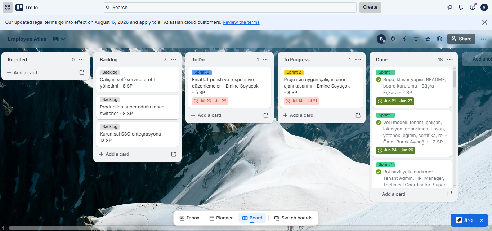
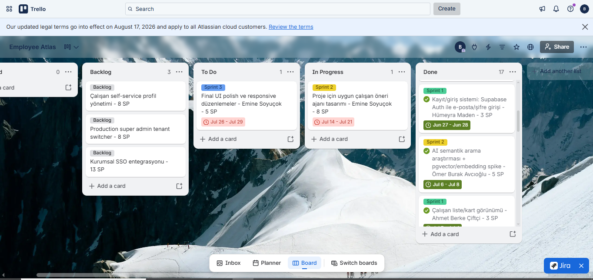

### Sprint puanlaması

Önceki sprintlerdeki puanlama mantığı sürdürüldü (planning poker benzeri göreceli büyüklük). Sprint 2 retrospektifindeki "AI görevlerini daha küçük, doğrulanabilir adımlara böl" aksiyonu uygulandı: Sprint 3 görevleri 4–5 SP'lik parçalara ayrıldı, tek bir 8 SP'lik büyük AI görevi açılmadı. Sprint 3 için **7 görev** açıldı ve toplam kapasite **33 SP** olarak belirlendi (Sprint 1 velocity 21, Sprint 2 planlaması 32 baseline alınarak).

- **5 SP** - birden fazla katmanı kapsayan entegrasyon/değerlendirme görevleri (E1, E2, E3, E4, E6)
- **4 SP** - test dokümantasyonu ve teslim hazırlığı görevleri (E5, E7)

| Kod | Görev | SP | Sorumlu | Durum |
| --- | --- | ---: | --- | --- |
| E1 | AI aramanın ürettiği filtrelerin kullanıcıya açık gösterimi (uygulanan filtre etiketleri + "yapay zeka / kural" kaynağı rozeti) | 5 | Ömer Burak Avcıoğlu | ✅ Tamamlandı |
| E2 | Doğal dil / "Akıllı ara" kutusunun çalışan dizini UI'ına entegrasyonu | 5 | Ömer Burak Avcıoğlu | ✅ Tamamlandı |
| E3 | Tenant bazlı fotoğraf storage path yapısının değerlendirilmesi | 5 | Ömer Burak Avcıoğlu | ✅ Tamamlandı |
| E4 | Final UI polish ve responsive düzenlemeler | 5 | Ahmet Berke Çiftçi | ✅ Tamamlandı |
| E5 | Cross-tenant test senaryolarının dokümantasyonu ve kontrol listesi | 4 | Büşra Eşkara | ✅ Tamamlandı |
| E6 | 3 dakikalık proje videosu senaryosu ve demo kaydı | 5 | Büşra Eşkara | ✅ Tamamlandı |
| E7 | Final README, sprint dokümanları ve teslim formu hazırlığı | 4 | Büşra Eşkara  | ✅ Tamamlandı |

- **Puanlama mantığı ve toplam:** 7 görev · 33 SP (4/5 SP göreceli büyüklük)
- **Tamamlanan:** 33 / 33 SP → **%100 tamamlanma** · Sprint 3 velocity: 33 SP
- **Not:** E1'in kapsamı, yapay zeka aramasının **açıklanabilirliği** olarak teslim edildi - model çalışan verisini görmeden yalnızca filtre değeri döndürür ve UI, uygulanan filtreleri ve sonucun yapay zekadan mı yoksa kural tabanlı yedekten mi geldiğini kullanıcıya açıkça gösterir. Bir projeye çalışan sıralayan **bağımsız öneri ajanı** ise bilinçli olarak bootcamp sonrası backlog'a bırakıldı (aşağıdaki "Bilinen sınırlar" bölümü).

### Daily Scrum

- **Nereden görüştük:** Önceki sprintlerle aynı şekilde günlük senkronizasyon **WhatsApp** grubu (hızlı durum/blocker) ve **Slack** (teknik koordinasyon) üzerinden yürütüldü. Sprint 2 retrospektif aksiyonu (günlük notların düzenli tutulması ve QA kanıtlarının iş bittikçe eklenmesi) Sprint 3'te de sürdürüldü.
- **Ekran görüntüsü:**

[Google Drive Linki](https://drive.google.com/drive/folders/1MM2pZs08pq-Dhpt-ngBlGd5QeMjz5Kbh?usp=sharing)

### Ürün geliştirme durumu

Sprint 3'te ürün, Sprint 1'in MVP çekirdeği ve Sprint 2'nin kalite/AI altyapısı üzerine **final entegrasyon ve cila** aşamasına getirildi. Öne çıkanlar:

**Doğal dil ("Akıllı ara") araması — canlı** - Dizin sayfasındaki arama kutusuna gündelik Türkçe ile yazılan sorgu (ör. "İzmir ofisindeki çalışanlar", "5G bilen kişiler") Google Gemini ile yapılandırılmış filtrelere çevrilip dizine uygulanır. Model **hiç çalışan verisi görmez**; yalnızca aktif kiracının filtre sözlüğünü görür ve yalnızca filtre değeri döndürür — döndürdüğü her değer aynı sözlükle yeniden doğrulanır, arama yine RLS + uygulama katmanı kiracı filtresinden geçer. API anahtarı yoksa sistem kural tabanlı ayrıştırıcıya düşer, özellik kapanmaz. (Sprint 2'de "pgvector + embedding" yönünde araştırılan yaklaşım yerine, güvenlik sınırını gevşetmeyen bu **filtre-sözlüğü** yaklaşımında karar kılındı.)

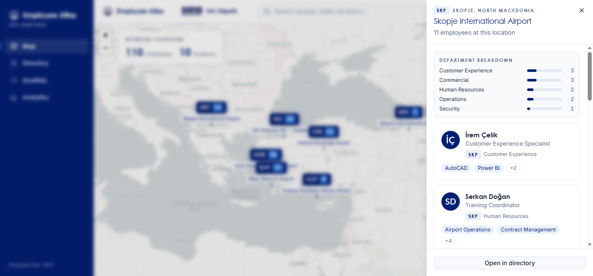
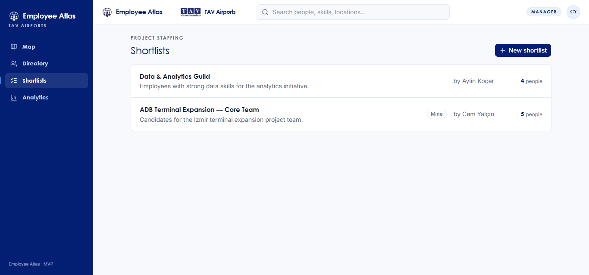
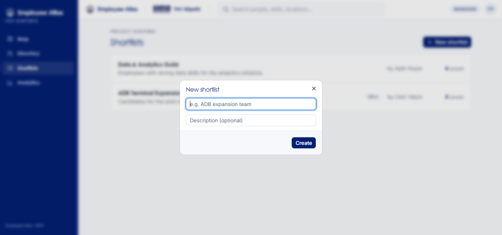
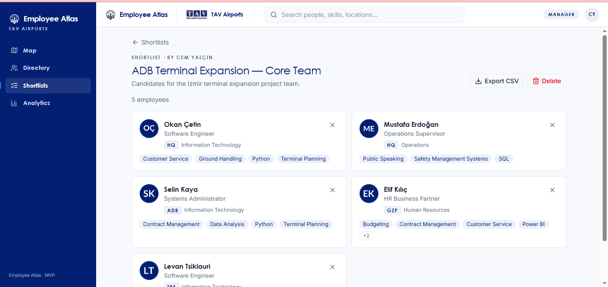
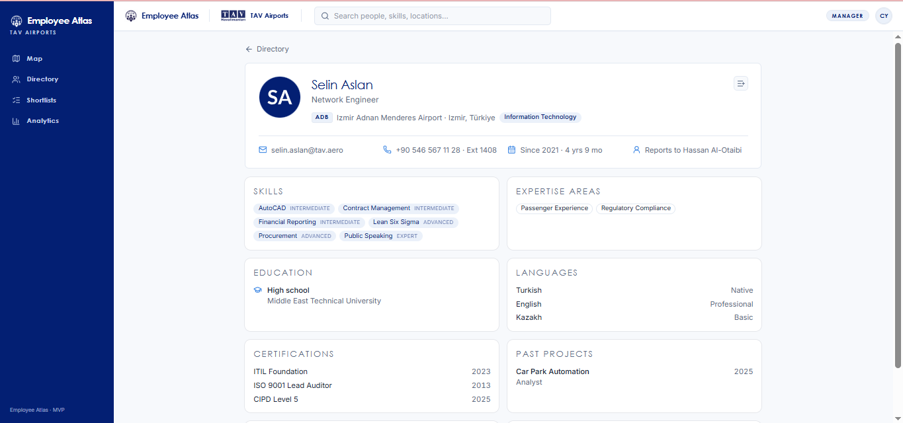

### Sprint Review

Sprint 3, canlı ürünü final demo ve teslim kalitesine getirmeye odaklandı. Yapılanlar ve verilen kararlar:

- **Yapay zeka araması UI'a tam entegre edildi (E1–E2):** "Akıllı ara" kutusu çalışan dizinine yerleştirildi; sonuç ekranı, uygulanan filtreleri ve sonucun yapay zekadan mı yoksa kural tabanlı yedekten mi geldiğini kullanıcıya gösterir. Böylece arama **açıklanabilir** hale geldi.
- **AI arama yaklaşımı sadeleştirildi ve netleştirildi:** Sprint 2'de araştırılan embedding/pgvector yönü yerine, modelin yalnızca kiracının filtre sözlüğünü görüp filtre değeri döndürdüğü, güvenlik sınırını gevşetmeyen yaklaşım final ürün olarak sabitlendi.
- **Tenant fotoğraf storage değerlendirmesi yapıldı (E3):** Kiracı bazlı klasör ayrımı için path yapısı tasarlandı; gerçek fotoğraf yüklemesi bootcamp kapsamı dışında olduğundan uygulanması backlog'a alındı (karar dokümante edildi).
- **Final UI polish ve responsive (E4):** Kiracıya özel tema, kart/liste/tablo görünümleri ve mobil uyumluluk gözden geçirildi.
- **Cross-tenant test dokümantasyonu (E5):** Kiracı yalıtımının manuel doğrulama kontrol listesi hazırlandı; Sprint 2'deki otomatik pgTAP RLS test suite'i (5 dosya, 42 assertion) ve CI ile birlikte kiracılar-arası erişimin reddedildiği senaryolar belgelendi.
- **Teslim paketi (E6–E7):** 3 dakikalık proje videosu, jüri tek-sayfa dokümanı, final README ve sprint dokümanları hazırlandı.

Sprint 3 sonunda planlanan 7 hikaye (33/33 SP) tamamlandı. Ürün, iki senaryo kiracısı (TAV Airports, Turkcell) ile canlı ortamda tam akışıyla gösterilebilir durumda: giriş → harita → dizin (akıllı arama/filtre) → profil → aday listesi (CSV) → analytics → yönetim paneli → kiracı izolasyonu.

### Sprint Retrospective

**İyi gidenler:** Sprint 2 retrospektif aksiyonları uygulandı — AI görevleri küçük ve doğrulanabilir parçalara (4–5 SP) bölündü ve tek sprintte tamamlandı; QA/ekran görüntüsü kanıtları iş bittikçe eklendi; yapay zeka araması gerçekten canlıya entegre edildi. Erken spike disiplini (Sprint 2 D1) sayesinde final entegrasyon sürprizsiz geçti.

**Geliştirilecekler / bir sonraki proje için:**

- **Kapsamı erken netleştirmek:** Embedding/pgvector yönü araştırıldıktan sonra daha basit ve güvenli filtre-sözlüğü yaklaşımında karar kılındı; bu yön değişikliği daha erken sabitlenebilirdi.
- **Öneri ajanını ayrı bir iterasyona bırakmak:** Projeye çalışan sıralayan bağımsız öneri ajanı MVP kapsamında tam olarak tamamlanmadı; net bir sonraki-adım olarak backlog'a alındı.
- **Git katkısını dengede tutmak:** Sprint 1'den taşınan aksiyon; katkı dağılımı iyileşti, sürdürülmeli.

**Proje kapanışı:** Employee Atlas, sağlam çok-kiracılı temel (RLS + composite FK + uygulama katmanı), kalite altyapısı (pgTAP + CI) ve açıklanabilir yapay zeka araması ile bootcamp teslim hedeflerini karşıladı. Canlı demo: [empatlas.site](https://www.empatlas.site/) 

### Bilinen sınırlar (teslim notu)

Bir MVP olarak bilinçli şekilde kapsam dışında bırakılan ve backlog'a alınan başlıklar (jüri dokümanıyla tutarlı):

- **Bağımsız öneri ajanı** - bir proje/rol için en uygun çalışanları gerekçesiyle sıralayan ajan tasarlandı ancak MVP'de tam olarak shiplenmedi; bootcamp sonrası iş.
- **Tenant bazlı fotoğraf storage** - kiracı bazlı klasör ayrımı için path yapısı değerlendirildi; gerçek fotoğraf yüklemesi öncesine bırakıldı.
- **Production super admin tenant switcher** - şu an geliştirme ortamına özel mekanizma kullanılıyor.
- **Çalışan self-servis profil yönetimi** - MVP kapsamı dışında.

**Takım Notu — Sprint 3**
Emine Soyuçok, Sprint 1 ve Sprint 2'de tolere edilmesine ve görevlerinin ekip tarafından üstlenilmesine rağmen Sprint 3'te de projeye herhangi bir katkı sağlamadığından, ekip kararıyla pasif olarak gösterilmiştir.

Kendisiyle Telefon üzerinden birkaç kez iletişime geçilmiş, ancak ulaşılamamıştır. Ekip Asistanına (Kevser Hanım) bildirilmiş ve onay alınmıştır. 
